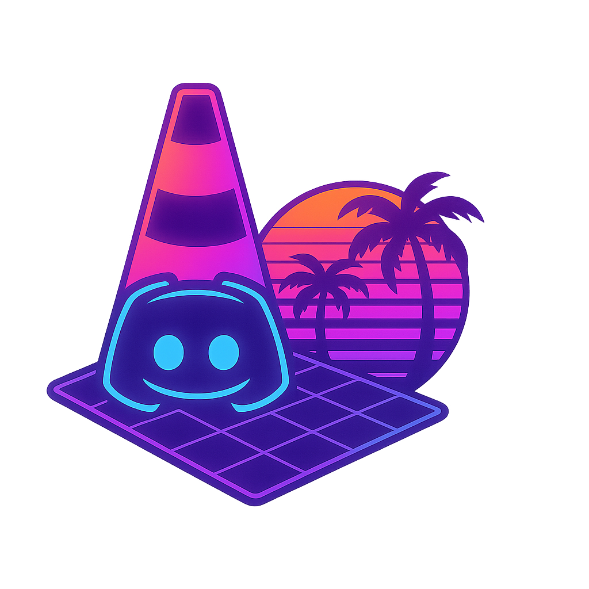
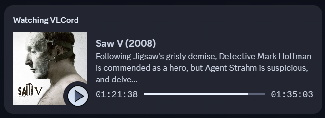
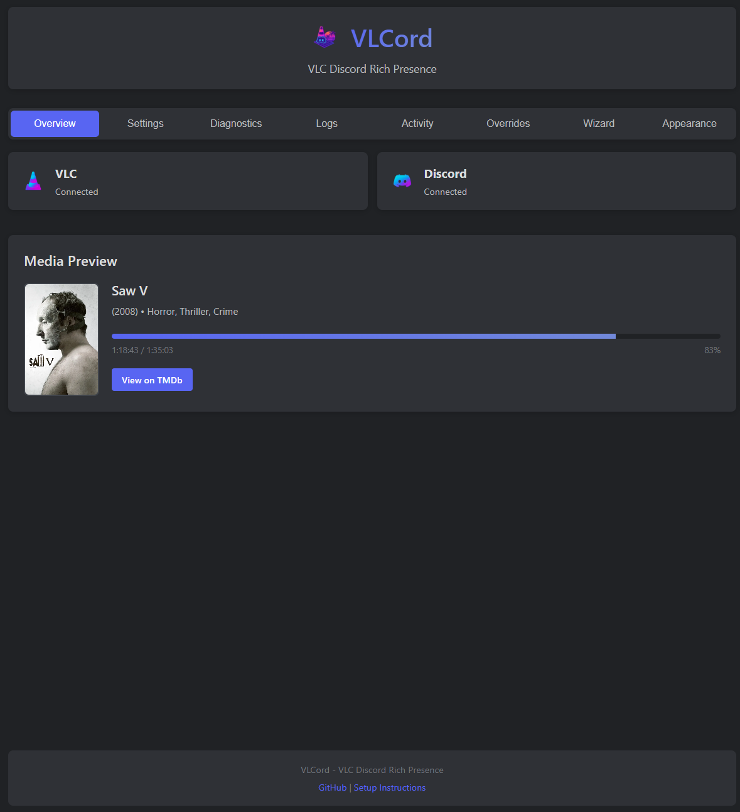
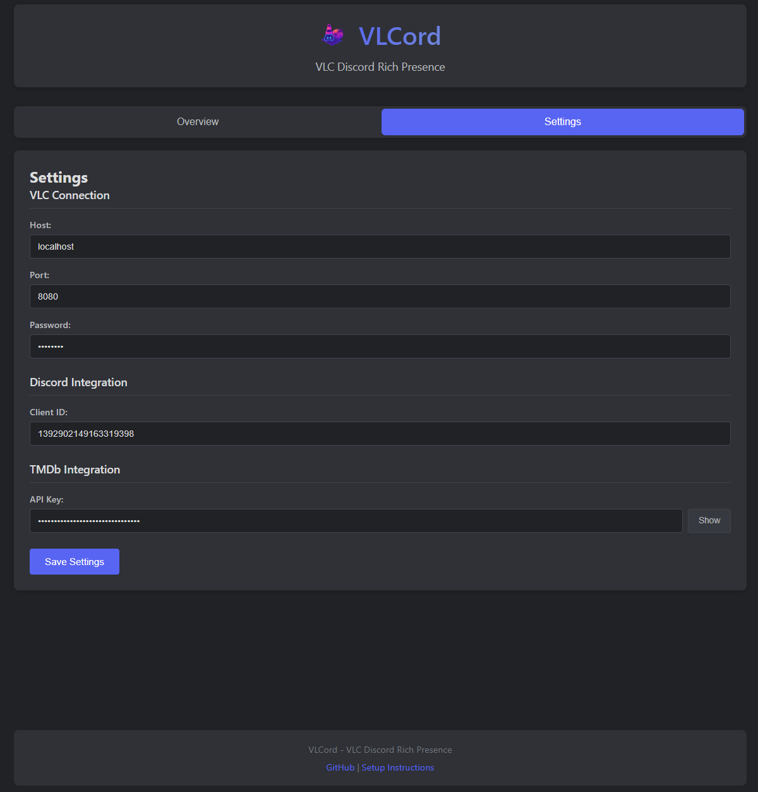

# VLCord



**VLCord** is a Discord Rich Presence integration for VLC Media Player that automatically displays what you're watching on Discord. It features a clean web interface, automatic movie/TV show detection with TMDb integration, and real-time status updates.

## ✨ Features

- 🎬 **Automatic Media Detection** - Recognizes movies, TV shows, and anime from filenames
- 🎭 **TMDb Integration** - Fetches rich metadata including posters, descriptions, and genres
- 🎮 **Discord Rich Presence** - Shows detailed "Watching" status with beautiful cards
- 🌐 **Web Interface** - Clean, modern dashboard for monitoring and configuration
- ⚡ **Real-time Updates** - Live progress tracking and play/pause status
- 🔧 **Easy Setup** - Automated VLC configuration and Discord app creation guides

## 📸 Screenshots

### Discord Rich Presence


### Web Interface



## 🚀 Quick Start

### Prerequisites

- **Node.js** 18.0.0 or higher
- **VLC Media Player** 3.0+ 
- **Discord** account

### Installation

1. **Clone the repository**
   ```bash
   git clone https://github.com/canna-dev/vlcord.git
   cd vlcord
   ```

2. **Install dependencies**
   ```bash
   npm install
   ```

3. **Configure environment** (optional)
   ```bash
   cp .env.example .env
   # Edit .env with your preferred settings
   ```

4. **Start VLCord**
   ```bash
   npm start
   ```

5. **Open the web interface**
   - Navigate to http://localhost:7100
   - Follow the setup wizard for VLC and Discord configuration

## ⚙️ Configuration

### VLC Setup

VLCord requires VLC's HTTP interface to be enabled. You can:

1. **Use the built-in setup wizard** (recommended)
   - Open http://localhost:7100
   - Click "Setup Instructions" 
   - Follow the automated setup process

2. **Manual setup**
   - Launch VLC with: `--intf http --http-host localhost --http-port 8080 --http-password vlcpassword`
   - Or enable via VLC Preferences → Interface → Main interfaces → Web

### Discord Application

1. Go to [Discord Developer Portal](https://discord.com/developers/applications)
2. Create a new application
3. Copy the Application ID to VLCord settings
4. Upload these assets under Rich Presence → Art Assets:
   - `vlc` - VLC logo
   - `play` - Play icon  
   - `pause` - Pause icon

### TMDb API (optional but recommended)

**VLCord works out-of-the-box with shared keys, but getting your own API key provides significant benefits:**

#### 🚀 Why get your own TMDb API key?

- **⚡ No rate limits** - Unlimited movie/TV show lookups vs shared quota
- **🚄 Faster responses** - Dedicated API quota just for you
- **🛡️ Better reliability** - No throttling from other users
- **🆓 Completely FREE** - Takes just 2 minutes to set up

#### 📝 TMDb Setup Steps

1. Sign up at [TheMovieDB](https://www.themoviedb.org/)
2. Go to Settings → API → Create new API key
3. Enter the API key in VLCord settings for enhanced metadata

### Discord Application (optional but recommended)

**VLCord includes a default Discord app, but creating your own provides customization:**

#### 🎮 Why create your own Discord app?

- **🏷️ Custom branding** - "YourName's VLCord" instead of generic name
- **🎨 Personal app icon** - Upload your own custom icon
- **⚡ Independent quotas** - No sharing with other users
- **🆓 Completely FREE** - Full control over your app

#### 📝 Discord Setup Steps

1. Go to [Discord Developer Portal](https://discord.com/developers/applications)
2. Create a new application
3. Copy the Application ID to VLCord settings
4. Upload these assets under Rich Presence → Art Assets:
   - `vlc` - VLC logo
   - `play` - Play icon  
   - `pause` - Pause icon

## 🎯 Usage

1. **Start VLCord** - Run `npm start`
2. **Open VLC** - Launch with HTTP interface enabled
3. **Play media** - Start watching any movie or TV show
4. **Check Discord** - Your status will automatically update

### Supported Formats

VLCord intelligently parses various filename formats:

- **Movies**: `Movie.Title.2023.1080p.BluRay.x264`
- **TV Shows**: `Show.Name.S01E05.Episode.Title.1080p`
- **Anime**: `[Group] Anime Title - 12 [1080p]`

## 🌐 Web Interface

Access the web dashboard at http://localhost:7100:

- **Overview Tab**: Real-time media status and connection monitoring
- **Settings Tab**: Configure VLC, Discord, and TMDb integration
- **Setup Wizard**: Guided configuration for first-time users

## 🔧 Development

### Running in Development Mode

```bash
npm run dev
```

This starts the server with nodemon for automatic restarts on file changes.

### Project Structure

```
vlcord/
├── src/
│   ├── main.js              # Main server entry point
│   ├── vlc-monitor.js       # VLC HTTP interface integration  
│   ├── discord-presence.js  # Discord RPC client
│   ├── title-cleaner.js     # Filename parsing logic
│   ├── tmdb-client.js       # TMDb API integration
│   └── config-manager.js    # Configuration management
├── public/
│   ├── index.html           # Web interface
│   ├── css/styles.css       # Styling
│   ├── js/app.js           # Frontend JavaScript
│   └── assets/             # Images and icons
└── docs/                   # Additional documentation
```

## 🛠️ Configuration Options

### Environment Variables (.env)

```env
# Server Configuration
PORT=7100
HOST=localhost

# VLC Configuration  
VLC_HOST=localhost
VLC_PORT=8080
VLC_PASSWORD=vlcpassword

# Discord Configuration
DISCORD_CLIENT_ID=your_client_id

# TMDb Configuration
TMDB_API_KEY=your_api_key

# Polling Configuration
POLLING_INTERVAL=1000
```

### Web Interface Settings

All settings can be configured through the web interface:

- **VLC Connection**: Host, port, and password
- **Discord Integration**: Application client ID
- **TMDb Integration**: API key for enhanced metadata
- **Real-time Testing**: Built-in connection testing tools

## 🐛 Troubleshooting

### Common Issues

**VLC Not Connecting**
- Ensure VLC HTTP interface is enabled
- Check host/port/password settings
- Try the built-in connection test

**Discord Not Updating**
- Verify Discord client ID is correct
- Make sure Discord is running
- Check Discord developer console for errors

**No Movie/TV Metadata**
- Add TMDb API key in settings
- Check filename formatting
- Verify internet connection

### Getting Help

1. Check the [Issues](https://github.com/canna-dev/vlcord/issues) page
2. Review the built-in setup instructions
3. Use the web interface diagnostic tools

## 🤝 Contributing

Contributions are welcome! Please feel free to submit a Pull Request. For major changes, please open an issue first to discuss what you would like to change.

### Development Guidelines

1. Fork the repository
2. Create a feature branch (`git checkout -b feature/amazing-feature`)
3. Commit your changes (`git commit -m 'Add amazing feature'`)
4. Push to the branch (`git push origin feature/amazing-feature`)
5. Open a Pull Request

## 📄 License

This project is licensed under the MIT License - see the [LICENSE](LICENSE) file for details.

## 🙏 Acknowledgments

- [Discord RPC](https://github.com/discordjs/RPC) for Discord integration
- [TMDb](https://www.themoviedb.org/) for movie/TV metadata
- [VLC Media Player](https://www.videolan.org/vlc/) for the awesome media player
- [parse-torrent-name](https://github.com/clement-escolano/parse-torrent-name) for filename parsing

## 📞 Support

If you enjoy VLCord, please consider:
- ⭐ Starring this repository
- 🐛 Reporting bugs
- 💡 Suggesting new features
- 🤝 Contributing code

---

**Made with ❤️ for the Discord and VLC communities**
