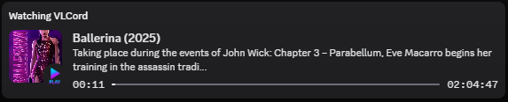
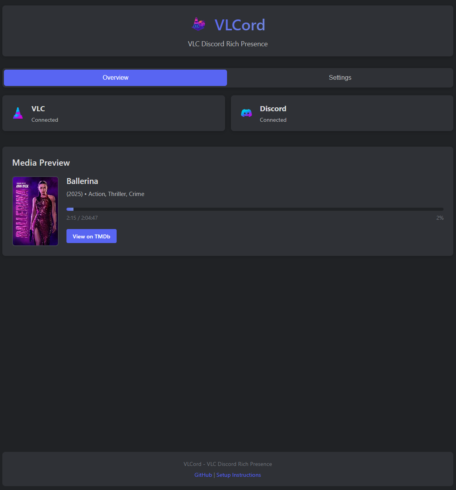

# VLCord

[](https://github.com/canna-dev/vlcord/actions/workflows/ci.yml)
[](package.json)
[](https://nodejs.org/)
[](LICENSE)


**VLCord** is a Discord Rich Presence integration for VLC Media Player that automatically displays what you're watching on Discord. It features a clean web interface, automatic movie/TV show detection with TMDb integration, and real-time status updates.

## ✨ Features

### Core Features
- 🎬 **Automatic Media Detection** - Recognizes movies, TV shows, and anime from filenames
- 🎭 **TMDb Integration** - Fetches rich metadata including posters, descriptions, and genres
- 🎮 **Discord Rich Presence** - Shows detailed "Watching" status with beautiful cards
- 🌐 **Web Interface** - Clean, modern dashboard for monitoring and configuration
- ⚡ **Real-time Updates** - Live progress tracking and play/pause status
- 🔧 **Easy Setup** - Automated VLC configuration and Discord app creation guides
- 🐳 **Docker Support** - One-command containerized deployment
- 📊 **Prometheus Metrics** - Built-in monitoring and observability
- ✅ **Smart Discord Detection** - Automatic detection of Discord client type with helpful guidance if using Web version instead of Desktop

### v2.0 Enhancements
- 🏥 **Enhanced Health Monitoring** - Real-time service diagnostics, recovery time estimation, and actionable recommendations
- 💾 **Redis Caching** - Distributed caching layer for 70% faster queries and multi-instance deployments
- 🔄 **Zero-Downtime Config Reloading** - Update configuration without restarting the application
- 🔍 **Advanced Dashboard** - Search and filter activities, export reports as CSV, view real-time logs, manually recover circuit breakers
- 📈 **Production-Ready Monitoring** - New API endpoints for system health, diagnostics, logs, and cache statistics

## 📸 Screenshots

### Discord Rich Presence


### Web Interface



## 🚀 Quick Start

### Prerequisites

- **Node.js** 18.0.0 or higher
- **VLC Media Player** 3.0+ 
- **Discord** account

### Installation

1. **Clone the repository**
   ```bash
   git clone https://github.com/canna-dev/vlcord.git
   cd vlcord
   ```

2. **Install dependencies**
   ```bash
   npm install
   ```

3. **Configure environment** (optional)
   ```bash
   cp .env.example .env
   # Edit .env with your preferred settings
   ```

4. **Start VLCord**
   ```bash
   npm start
   ```

5. **Open the web interface**
   - Navigate to http://localhost:7100
   - Follow the setup wizard for VLC and Discord configuration

### Docker Deployment

Deploy VLCord using Docker for consistent, isolated environments:

```bash
# Using docker-compose (recommended)
docker-compose up -d

# Or build and run manually
docker build -t vlcord .
docker run -d \
  -p 7100:7100 \
  -v $(pwd)/.env:/app/.env \
  --name vlcord \
  vlcord
```

**Features:**
- Alpine Linux base for minimal image size
- Volume mount for persistent configuration
- Port 7100 exposed for web interface
- Non-root user for security

See [VLC-SETUP.md](VLC-SETUP.md) for Docker networking and external VLC setup.

## 🆕 v2.0 Enhancements

### Enhanced Health Monitoring
Real-time system diagnostics with actionable recommendations:
- Service health tracking (Discord, VLC, TMDb, Database)
- Failure rate analysis and recovery time estimation
- Resource monitoring (CPU, memory, uptime)
- Automatic circuit breaker management with recovery suggestions

**Access**: `GET /health` endpoint or view in dashboard

### Redis Caching (Optional)
Distributed caching layer for improved performance:
- **70% faster** queries with optional Redis integration
- Multi-instance deployment support
- Automatic cache invalidation and TTL management
- Graceful fallback if Redis is unavailable

**Enable**: Set `REDIS_ENABLED=true` in `.env`

### Zero-Downtime Configuration Reloading
Update settings without restarting:
- File-watching with automatic validation
- Real-time service reconnection on credential changes
- Change tracking and audit logging

**Usage**: Edit `config.json` → automatically reloaded

### Advanced Dashboard Features
- **Search & Filter**: Find activities by title, status, or date range
- **Export Reports**: Download activity history as CSV
- **Live Logs**: Real-time system log viewer
- **Recovery Controls**: Manually reset circuit breakers from the dashboard

### Production-Ready APIs
New monitoring endpoints for integration and alerting:
- `GET /api/system/health/diagnostics` - Detailed system health
- `GET /api/system/health/:service` - Service-specific health
- `GET /api/system/logs` - System activity logs
- `GET /api/system/cache/status` - Cache statistics and performance
- `POST /api/system/circuit-breakers/:service/reset` - Manual breaker recovery

For complete API documentation, see [API.md](API.md).

## ⚙️ Configuration

### VLC Setup

VLCord requires VLC's HTTP interface to be enabled. You can:

1. **Use the built-in setup wizard** (recommended)
   - Open http://localhost:7100
   - Click "Setup Instructions" 
   - Follow the automated setup process

2. **Manual setup**
   - Launch VLC with: `--intf http --http-host localhost --http-port 8080 --http-password vlcpassword`
   - Or enable via VLC Preferences → Interface → Main interfaces → Web

### Discord Application

1. Go to [Discord Developer Portal](https://discord.com/developers/applications)
2. Create a new application
3. Copy the Application ID to VLCord settings
4. Upload these assets under Rich Presence → Art Assets:
   - `vlc` - VLC logo
   - `play` - Play icon  
   - `pause` - Pause icon

### TMDb API (optional but recommended)

**VLCord works out-of-the-box with shared keys, but getting your own API key provides significant benefits:**

#### 🚀 Why get your own TMDb API key?

- **⚡ No rate limits** - Unlimited movie/TV show lookups vs shared quota
- **🚄 Faster responses** - Dedicated API quota just for you
- **🛡️ Better reliability** - No throttling from other users
- **🆓 Completely FREE** - Takes just 2 minutes to set up

#### 📝 TMDb Setup Steps

1. Sign up at [TheMovieDB](https://www.themoviedb.org/)
2. Go to Settings → API → Create new API key
3. Enter the API key in VLCord settings for enhanced metadata

### Discord Application (optional but recommended)

**VLCord includes a default Discord app, but creating your own provides customization:**

#### 🎮 Why create your own Discord app?

- **🏷️ Custom branding** - "YourName's VLCord" instead of generic name
- **🎨 Personal app icon** - Upload your own custom icon
- **⚡ Independent quotas** - No sharing with other users
- **🆓 Completely FREE** - Full control over your app

#### 📝 Discord Setup Steps

1. Go to [Discord Developer Portal](https://discord.com/developers/applications)
2. Create a new application
3. Copy the Application ID to VLCord settings
4. Upload these assets under Rich Presence → Art Assets:
   - `vlc` - VLC logo
   - `play` - Play icon  
   - `pause` - Pause icon

## 🎯 Usage

1. **Start VLCord** - Run `npm start`
2. **Open VLC** - Launch with HTTP interface enabled
3. **Play media** - Start watching any movie or TV show
4. **Check Discord** - Your status will automatically update

### Supported Formats

VLCord intelligently parses various filename formats:

- **Movies**: `Movie.Title.2023.1080p.BluRay.x264`
- **TV Shows**: `Show.Name.S01E05.Episode.Title.1080p`
- **Anime**: `[Group] Anime Title - 12 [1080p]`

## 🌐 Web Interface

Access the web dashboard at http://localhost:7100:

- **Overview Tab**: Real-time media status and connection monitoring
- **Settings Tab**: Configure VLC, Discord, and TMDb integration
- **Setup Wizard**: Guided configuration for first-time users

## � REST API

VLCord exposes REST endpoints for programmatic access:

### Status Endpoint
```
GET /api/status
```
Returns current VLC playback status and media information.

**Response:**
```json
{
  "connected": true,
  "playing": true,
  "title": "Movie Title",
  "mediaType": "movie",
  "position": 0.45,
  "elapsed": 1200,
  "length": 2700,
  "metadata": {
    "title": "Movie Title",
    "poster_path": "/path/to/poster.jpg",
    "vote_average": 8.5
  }
}
```

### Configuration Endpoints
```
GET /api/config        # Get current configuration
POST /api/config       # Update configuration (requires admin token)
```

**Admin Token:**
Set `ADMIN_TOKEN` environment variable to protect configuration endpoints.

```bash
curl -H "Authorization: Bearer your_token" \
  -X POST http://localhost:7100/api/config \
  -H "Content-Type: application/json" \
  -d '{"pollingInterval": 2000}'
```

### Health & Metrics
```
GET /health           # Liveness check
GET /ready            # Readiness check
GET /metrics          # Prometheus metrics
```

## �🔧 Development

### Running in Development Mode

```bash
npm run dev
```

This starts the server with nodemon for automatic restarts on file changes.

### Project Structure

```
vlcord/
├── src/
│   ├── main.js                  # Main server entry point
│   ├── vlc-monitor.js           # VLC HTTP polling and status management
│   ├── vlc-poller.js            # VLC HTTP interface abstraction with retries
│   ├── vlc-parser.js            # VLC status parsing and metadata extraction
│   ├── discord-presence.js      # Discord RPC integration
│   ├── discord-client.js        # Discord RPC lifecycle management
│   ├── presence-builder.js      # Rich Presence activity builders
│   ├── title-cleaner.js         # Filename parsing and normalization
│   ├── tmdb-client.js           # TMDb API integration
│   ├── tmdb-format.js           # TMDb response formatting
│   ├── tv-show-helper.js        # TV show detection and parsing
│   ├── anime-titles.js          # Anime title formatting
│   ├── config-manager.js        # Configuration management with atomic writes
│   └── override-detector.js     # Override detection logic
├── public/
│   ├── index.html               # Web interface
│   ├── css/styles.css           # Styling
│   ├── js/app.js               # Frontend JavaScript
│   └── assets/                 # Images and icons
├── tests/
│   ├── title-cleaner.test.js   # Title parsing unit tests
│   └── tv-show-helper.test.js  # TV detection unit tests
├── scripts/
│   ├── setup_env.bat           # Windows environment setup
│   └── setup_env.sh            # Unix environment setup
├── Dockerfile                  # Container image definition
├── docker-compose.yml          # Multi-container orchestration
├── .eslintrc.cjs              # Linting configuration
├── .prettierrc                # Code formatting configuration
├── jest.config.cjs            # Test runner configuration
└── package.json               # Dependencies and scripts
```

## 🏗️ Architecture

### Component Overview

**VLC Monitor** - Polls VLC HTTP interface every 1000ms (non-blocking) and parses playback state
- Uses exponential backoff for connection retries
- LRU cache (500 entries, 24h TTL) for metadata to prevent memory bloat

**TMDb Client** - Fetches metadata from The Movie Database API
- Automatic retry with backoff for rate limit handling
- Includes external IDs for IMDb links in Discord buttons

**Discord Presence** - Manages Rich Presence updates
- Modular activity builders for movies, TV shows, and anime
- Intelligent title extraction from metadata

**Web Server** - Express.js with Socket.IO for real-time updates
- REST API for status and configuration
- Prometheus metrics endpoint for monitoring
- Health checks for Kubernetes/container orchestration

### Performance Optimizations

- **Non-overlapping polling**: Single scheduled poll prevents concurrent requests
- **LRU metadata caching**: Avoids redundant API calls for same titles
- **Exponential backoff**: Reduces server load during connection issues
- **Modular architecture**: Small focused modules enable tree-shaking and faster startup
- **Atomic config writes**: Write-to-temp-file pattern prevents corruption

## 🔧 Development

## 🛠️ Configuration Options

### Environment Variables (.env)

All configuration is managed through environment variables. Copy `.env.example` to `.env` to customize:

```env
# ============= Server Configuration =============
PORT=7100                          # Web server port (or WEB_PORT)
HOST=localhost                     # Web server hostname

# ============= VLC Configuration =============
VLC_HOST=localhost                 # VLC HTTP interface hostname
VLC_PORT=8080                      # VLC HTTP interface port
VLC_PASSWORD=vlcpassword          # VLC HTTP interface password

# ============= Discord Configuration =============
DISCORD_CLIENT_ID=your_client_id   # Discord application client ID

# ============= TMDb Configuration =============
TMDB_API_KEY=your_api_key         # TheMovieDB API key (optional - uses shared key if not set)

# ============= Polling Configuration =============
POLLING_INTERVAL=1000              # VLC status poll interval (ms)

# ============= Cache Configuration =============
CACHE_MAX_ENTRIES=500              # Maximum metadata cache entries
CACHE_TTL=86400000                 # Cache time-to-live (ms, 24h default)

# ============= Admin Configuration =============
ADMIN_TOKEN=your_secret_token     # Token for protected API endpoints (optional)
```

### Configuration Precedence

1. Environment variables (highest priority)
2. `.env` file
3. Defaults in code (lowest priority)

### Port Configuration

- **WEB_PORT** takes precedence over **PORT** if both are set
- Default is port 7100

### Accessing Configuration

Via web interface: http://localhost:7100 → Settings tab

Via API:
```bash
GET /api/config                   # Get current settings
POST /api/config                  # Update settings (requires ADMIN_TOKEN)
```

## 🛠️ Advanced Configuration

## 🐛 Troubleshooting

### Common Issues

**VLC Not Connecting**
- Ensure VLC HTTP interface is enabled
- Check host/port/password settings
- Try the built-in connection test

**Discord Not Updating**
- Verify Discord client ID is correct
- Make sure Discord is running
- Check Discord developer console for errors

**Discord Web App Instead of Desktop**

VLCord **requires Discord Desktop** application with Rich Presence (RPC) support. It does NOT work with Discord's web version.

**Symptoms:**
- Error message: "Discord Desktop app not detected"
- IPC connection failed
- "Could not find Discord" errors

**Solution:**
1. Download and install **Discord Desktop** from https://discord.com/download
2. Close Discord Web browser tab if you have it open
3. Make sure Discord Desktop is running before starting VLCord
4. Restart VLCord

**Why?** VLCord uses Discord's IPC (Inter-Process Communication) protocol for Rich Presence, which only works with the Desktop application. Web Discord cannot communicate with local applications this way.

**Check Your Discord Type:**
- ✅ **Desktop**: Standalone application downloaded from discord.com, can run while closed
- ❌ **Web**: Accessed through web browser (discord.com in browser tab)
- ❌ **Mobile**: Phone/tablet apps - these also don't support RPC

**No Movie/TV Metadata**
- Add TMDb API key in settings
- Check filename formatting
- Verify internet connection

### Getting Help

1. Check the [Issues](https://github.com/canna-dev/vlcord/issues) page
2. Review the built-in setup instructions
3. Use the web interface diagnostic tools

## 🤝 Contributing

Contributions are welcome! Please feel free to submit a Pull Request. For major changes, please open an issue first to discuss what you would like to change.

### Development Guidelines

1. Fork the repository
2. Create a feature branch (`git checkout -b feature/amazing-feature`)
3. Commit your changes (`git commit -m 'Add amazing feature'`)
4. Push to the branch (`git push origin feature/amazing-feature`)
5. Open a Pull Request

## 📄 License

This project is licensed under the MIT License - see the [LICENSE](LICENSE) file for details.

## 🙏 Acknowledgments

- [Discord RPC](https://github.com/discordjs/RPC) for Discord integration
- [TMDb](https://www.themoviedb.org/) for movie/TV metadata
- [VLC Media Player](https://www.videolan.org/vlc/) for the awesome media player
- [parse-torrent-name](https://github.com/clement-escolano/parse-torrent-name) for filename parsing

## 📞 Support

If you enjoy VLCord, please consider:
- ⭐ Starring this repository
- 🐛 Reporting bugs
- 💡 Suggesting new features
- 🤝 Contributing code

---

**Made with ❤️ for the Discord and VLC communities**
